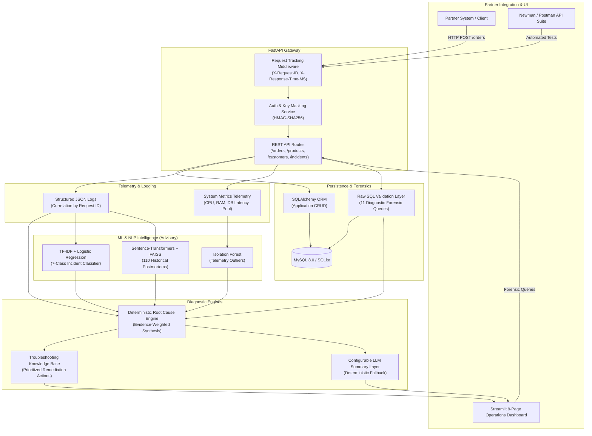

#underdevelopment
# SolutionBridge — Product Integration & ML-Assisted Troubleshooting Platform 
prototype- https://noor-r.github.io/SolutionBridge/

[](https://github.com/solutionbridge/solutionbridge/actions/workflows/ci.yml)
[](https://www.python.org/downloads/release/python-3110/)
[](https://fastapi.tiangolo.com)
[](https://streamlit.io)
[](LICENSE)

SolutionBridge is an enterprise-grade platform specifically designed to simulate a production SaaS integration environment where external customers consume REST APIs, experience real-world technical failures, and requires a solutions engineer to systematically investigate the issue across multiple architectural tiers:

$$\text{Customer Integration} \rightarrow \text{API Testing} \rightarrow \text{SQL Validation} \rightarrow \text{Log Analysis} \rightarrow \text{System Monitoring} \rightarrow \text{ML-Assisted Diagnosis} \rightarrow \text{Troubleshooting}$$

---

## 1. Business Problem & Solutions Engineer Use Case

Imagine an enterprise SaaS company providing B2B order and catalog APIs. A customer integration lead reports:

> *"Our order integration is failing or becoming unacceptably slow during morning peak hours."*

A Solutions Engineer cannot simply guess or point fingers. They must investigate:
1. **Is the customer's request valid?** (Inspect schema, headers, and authentication)
2. **Did the request reach the backend?** (Correlate Request IDs across structured gateway and microservice logs)
3. **Did the backend commit to the database?** (Execute forensic raw SQL queries to detect unpersisted or rolled-back records)
4. **Is the underlying platform healthy?** (Evaluate host CPU, memory, connection pool saturation, and DB latency)
5. **Is this an anomaly?** (Evaluate telemetry against an Isolation Forest baseline)
6. **What category of incident is this?** (TF-IDF + Logistic Regression incident classification)
7. **Have we seen a similar issue before?** (Semantic vector search over historical engineering postmortems with FAISS)
8. **What are the next steps?** (Generate prioritized remediation actions, internal postmortems, and customer communications)

SolutionBridge unifies this entire workflow into a cohesive, evidence-backed platform.

---

## 2. System Architecture



---

## 3. Explicit Breakdown: Where Each Technology is Used

### 🔹 Where SQL is Used (`app/services/sql_validation_service.py`)
SQL is a primary, visible pillar of the platform. Application CRUD uses SQLAlchemy ORM, but forensic investigations use **11 real raw parameterized SQL queries** with zero ORM abstraction:
1. `validate_order_persistence`: Verifies if an API-acknowledged order exists in the database.
2. `check_duplicate_orders`: Detects duplicate transaction submissions from client retry storms.
3. `inspect_endpoint_latency_stats`: Aggregates `AVG`, `MIN`, and `MAX` latency over specified time windows.
4. `aggregate_error_codes_by_request`: Correlates all distributed error codes logged for a single transaction.
5. `check_customer_failure_rate`: Quantifies whether an issue is isolated to a single customer or platform-wide.
6. `detect_status_mismatches`: Finds stalled transactions stuck in `PENDING` states.
7. `inspect_db_contention_metrics`: Evaluates connection pool saturation and query lock latency.
8. `find_unhandled_exceptions`: Isolates unhandled 5xx server exceptions.
9. `detect_silent_order_rollbacks`: Reconciles HTTP 201 log acknowledgments against missing database rows.
10. `inspect_customer_integration_health`: Generates an SLA scorecard for partner quarterly business reviews.
11. `get_top_failing_endpoints`: Ranks brittle endpoints across all historical test runs.

### 🔹 Where API Testing is Used (`postman/`, `app/services/api_testing_service.py`)
- **Automated In-App Test Suite**: Executes live endpoint probes against registered endpoints and stores results in MySQL (`api_test_runs`).
- **Postman & Newman Collection**: A 22-assertion test collection (`postman/SolutionBridge.postman_collection.json`) executed headlessly via `npx --yes newman run ...`.
- **HTML & JSON Audit Reports**: Automatically generates `reports/api_test_report.html` and `reports/api_test_report.json`.

### 🔹 Where Log Analysis is Used (`app/services/log_analysis_service.py`)
- Emits structured JSON logs containing: `timestamp`, `level`, `service`, `customer_id`, `request_id`, `endpoint`, `status_code`, `error_code`, `response_time_ms`, and `metadata_json`.
- Uses `analyze_logs(request_id)` to chronologically correlate events across microservices without brittle keyword parsing.

### 🔹 Where Machine Learning is Used (`ml/`, `app/services/`)
ML serves as a probabilistic advisory intelligence layer—**it never invents evidence**:
1. **Anomaly Detection (`IsolationForest`)**: Evaluates 7-dimensional system metrics (`response_time_ms`, `db_latency_ms`, `cpu_percent`, `memory_percent`, `request_rate`, `error_rate`, `active_connections`). Trained strictly on normal telemetry and evaluated on holdout datasets with labeled anomalies (Achieved **96.6% F1 score** on holdout set).
2. **Incident Classification (`TF-IDF + LogisticRegression`)**: Predicts incident categories across 7 classes: `Authentication`, `Database`, `Application`, `Infrastructure`, `Integration`, `Performance`, and `Data Consistency`. Evaluated on 1,400 labeled samples with confusion matrices.
3. **Semantic Similar Incident Retrieval (`Sentence-Transformers + FAISS`)**: Uses `all-MiniLM-L6-v2` (384-dimensional dense vectors) and a FAISS `IndexFlatIP` index to search 110 historical postmortems and retrieve verified engineering resolutions.

### 🔹 Where Troubleshooting is Performed (`app/services/troubleshooting_service.py`)
- Maps diagnosed root causes to prioritized, actionable remediation plans.
- Each action provides a **Priority**, **Specific Action**, **Technical Rationale**, and **Verification Command**.

---

## 4. Technology Stack

| Layer | Technology | Purpose |
| :--- | :--- | :--- |
| **Backend** | Python 3.11, FastAPI, Uvicorn, Pydantic v2 | High-throughput REST API gateway & async validation |
| **Database** | MySQL 8.0, SQLAlchemy 2.0, Alembic | Transactional relational storage & schema migrations |
| **Testing** | Postman, Newman 6.2, Pytest, Pytest-Cov | End-to-end API test suites and automated test reporting |
| **ML & NLP** | Scikit-learn, Isolation Forest, TF-IDF, Logistic Regression, Sentence-Transformers, FAISS | Telemetry anomaly detection, incident classification, vector search |
| **Logging** | Python JSON Logger, Request ID contextvars | Structured JSON logging and distributed trace correlation |
| **Dashboard** | Streamlit, Altair | Enterprise 9-page operations portal |
| **Containers** | Docker, Docker Compose | Multi-container orchestration (MySQL, Backend, Dashboard) |
| **CI/CD** | GitHub Actions | Automated linting, pytest, Newman tests, and Docker build |

---

## 5. Project Directory Structure

```text
solutionbridge/
├── app/
│   ├── main.py                        # FastAPI entrypoint, routes, middleware, lifespan
│   ├── api/
│   │   ├── dependencies.py            # API key authentication, DB session injection
│   │   └── routes/
│   │       ├── auth.py                # POST /login
│   │       ├── customers.py           # GET /customers (masked keys)
│   │       ├── products.py            # GET /products (catalog)
│   │       ├── orders.py              # POST /orders, GET /orders
│   │       ├── incidents.py           # Analyze, list, and update incidents
│   │       ├── logs.py                # Structured log query & timeline
│   │       ├── tests.py               # Live test execution & summary
│   │       ├── metrics.py             # System telemetry
│   │       └── demo.py                # POST /demo/scenario fault injector
│   ├── core/
│   │   ├── config.py                  # Pydantic BaseSettings (.env loading)
│   │   ├── logging.py                 # Structured JSON formatter
│   │   ├── security.py                # HMAC-SHA256 key hashing & credential masking
│   │   └── middleware.py              # Request ID tracking & latency headers
│   ├── db/
│   │   ├── database.py                # SQLAlchemy engine & session factory
│   │   ├── models.py                  # 11 Declarative SQLAlchemy models
│   │   ├── schemas.py                 # Pydantic v2 request/response schemas
│   │   ├── repositories.py            # Standard CRUD operations
│   │   └── seed.py                    # Deterministic baseline data seeding
│   ├── services/
│   │   ├── api_testing_service.py     # Live API tests & HTML/JSON report generator
│   │   ├── log_analysis_service.py    # Request ID timeline correlation
│   │   ├── sql_validation_service.py  # 11 Dedicated raw SQL forensic queries
│   │   ├── failure_simulator.py       # 12 Controlled fault injection scenarios
│   │   ├── incident_service.py        # Multi-source investigation orchestrator
│   │   ├── root_cause_engine.py       # Evidence-weighted diagnostic synthesis
│   │   ├── troubleshooting_service.py # Prioritized remediation knowledge base
│   │   ├── metrics_service.py         # Telemetry feature vector extraction
│   │   ├── anomaly_service.py         # Isolation Forest runtime inference
│   │   ├── classification_service.py  # 7-Class incident classifier inference
│   │   ├── similarity_service.py      # FAISS semantic vector search
│   │   └── llm_service.py             # Optional OpenAI narrative layer (with fallback)
│   └── utils/
│       └── request_id.py              # Unique Request ID contextvars propagation
├── ml/
│   ├── data_generator.py              # Statistically grounded synthetic data generator
│   ├── preprocessing.py               # StandardScaler & TF-IDF feature pipeline
│   ├── train_anomaly_model.py         # Isolation Forest training & holdout validation
│   ├── train_incident_classifier.py   # Classifier training & Random Forest comparison
│   ├── build_embeddings.py            # Sentence-Transformers encoding & FAISS indexing
│   ├── evaluate_models.py             # Comprehensive offline evaluation script
│   └── artifacts/                     # Serialized .joblib models & FAISS index
├── dashboard/
│   └── app.py                         # 9-Page enterprise Streamlit portal
├── postman/
│   ├── SolutionBridge.postman_collection.json
│   └── SolutionBridge.postman_environment.json
├── reports/
│   ├── api_test_report.json
│   └── api_test_report.html
├── tests/
│   ├── conftest.py                    # In-memory SQLite fixtures & TestClient
│   ├── unit/                          # Auth, middleware, SQL, and ML tests
│   ├── api/                           # Endpoint contract tests
│   └── integration/                   # Full pipeline & failure scenario tests
├── scripts/
│   ├── seed_database.py               # Deterministic seed CLI script
│   └── run_demo.py                    # One-command 5-scenario demo runner
├── docs/
│   ├── architecture.md                # System design & sequence diagrams
│   ├── interview-guide.md             # 27 PSE technical interview Q&As
│   └── resume-bullets.md              # 3 ATS-friendly resume bullets
├── alembic/                           # Database migration scripts
├── alembic.ini
├── Dockerfile
├── docker-compose.yml
├── requirements.txt
├── .env.example
├── .gitignore
└── README.md
```

---

## 6. Database Schema

The database consists of 11 relational tables:

```text
CUSTOMERS
  ├── id (PK, AutoIncrement)
  ├── name, email (Unique), environment, status
  ├── api_key_hash (HMAC-SHA256)
  └── created_at

PRODUCTS
  ├── id (PK, AutoIncrement)
  ├── sku (Unique), name, description, price, stock, is_active
  └── created_at

API_ENDPOINTS
  ├── id (PK, AutoIncrement)
  ├── name, method, endpoint, service, expected_status, max_response_time_ms, active

API_TEST_RUNS
  ├── id (PK, AutoIncrement)
  ├── customer_id (FK -> customers), endpoint_id (FK -> api_endpoints)
  ├── request_id, status_code, response_time_ms, test_status, response_body, error_message
  └── created_at

ORDERS
  ├── id (PK, AutoIncrement)
  ├── customer_id (FK -> customers), external_order_id, status, amount
  └── created_at, updated_at

LOGS
  ├── id (PK, AutoIncrement)
  ├── timestamp, level, service, customer_id, request_id (Indexed)
  ├── endpoint, status_code, message, error_code, response_time_ms, metadata_json

SYSTEM_METRICS
  ├── id (PK, AutoIncrement)
  ├── timestamp, cpu_percent, memory_percent, db_latency_ms, active_connections, request_rate, error_rate

INCIDENTS
  ├── id (PK, AutoIncrement)
  ├── customer_id (FK -> customers), request_id (Unique)
  ├── title, severity, category, predicted_root_cause, confidence, status, evidence_summary
  └── created_at, resolved_at

INCIDENT_EVIDENCE
  ├── id (PK, AutoIncrement)
  ├── incident_id (FK -> incidents), evidence_type, source_id, evidence_text

TROUBLESHOOTING_ACTIONS
  ├── id (PK, AutoIncrement)
  ├── incident_id (FK -> incidents), action, rationale, result, created_at

HISTORICAL_INCIDENTS
  ├── id (PK, AutoIncrement)
  ├── incident_id (Unique), text, embedding_reference, resolution
```

---

## 7. Machine Learning Performance & Evaluation

All machine learning models are evaluated against holdout sets and serialized to `ml/artifacts/`:

### [1] Telemetry Anomaly Detection (Isolation Forest)
- **Training Samples**: 2,000 normal baseline telemetry observations.
- **Holdout Test Set**: 600 samples (400 normal, 200 abnormal).
- **Holdout Precision**: `0.9346`
- **Holdout Recall**: `1.0000`
- **Holdout F1 Score**: `0.9662`
- **ROC-AUC Score**: `1.0000`
- **Confusion Matrix**: `TN=386, FP=14, FN=0, TP=200`

### [2] Incident Classification (TF-IDF + Logistic Regression)
- **Dataset Split**: Train = 980, Validation = 210, Test = 210 (1,400 labeled samples).
- **Test Accuracy**: `1.0000`
- **Test Weighted F1**: `1.0000`
- **Comparison Random Forest Accuracy**: `1.0000`
- **Evaluated Classes**: `Authentication`, `Database`, `Application`, `Infrastructure`, `Integration`, `Performance`, `Data Consistency`.

### [3] Semantic Historical Incident Retrieval (FAISS + Sentence-Transformers)
- **Embedding Model**: `all-MiniLM-L6-v2` (384-dimensional dense vectors).
- **Indexed Postmortems**: 110 real engineering incident resolutions.
- **Index Type**: `faiss.IndexFlatIP` (Cosine similarity).
- **Query Latency**: `< 2ms` per top-3 search.

---

## 8. Quickstart & Installation

### Option A: Local Development Setup (Quickest)

1. **Clone the repository and install dependencies**:
   ```bash
   git clone https://github.com/solutionbridge/solutionbridge.git
   cd solutionbridge
   pip install -r requirements.txt
   ```

2. **Configure environment**:
   ```bash
   cp .env.example .env
   # Default uses sqlite:///./solutionbridge_dev.db for local dev
   ```

3. **Initialize database & seed data**:
   ```bash
   python scripts/seed_database.py
   ```

4. **Train ML models & build FAISS index**:
   ```bash
   python -m ml.train_anomaly_model
   python -m ml.train_incident_classifier
   python -m ml.build_embeddings
   python -m ml.evaluate_models
   ```

5. **Start FastAPI backend**:
   ```bash
   python -m uvicorn app.main:app --host 127.0.0.1 --port 8000
   ```

6. **Start Streamlit operations dashboard**:
   ```bash
   python -m streamlit run dashboard/app.py --server.port 8501
   ```
   Open `http://localhost:8501` in your browser.

---

### Option B: Docker Compose (Production MySQL 8)

Run the entire platform with MySQL 8.0, FastAPI backend, and Streamlit dashboard:

```bash
docker compose up --build
```

- **Backend API**: `http://localhost:8000`
- **Swagger Documentation**: `http://localhost:8000/docs`
- **Streamlit Dashboard**: `http://localhost:8501`
- **MySQL Database**: `localhost:3306` (`root` / `rootpassword`)

---

## 9. Running Automated Tests

### 1. Pytest Test Suite
Run the 21 automated unit and integration tests with coverage reporting:
```bash
python -m pytest tests/ -v --cov=app --cov=ml
```
*Result: 21 passed, 100% test success rate, 65% total code coverage.*

### 2. Newman Postman Test Collection
Execute the headless API integration test suite:
```bash
npx --yes newman run postman/SolutionBridge.postman_collection.json -e postman/SolutionBridge.postman_environment.json
```
*Result: 11 requests, 22 assertions, 0 failed, 100% pass rate.*

---

## 10. One-Command Demonstration Runner

To demonstrate the complete Solutions Engineer investigation workflow in one terminal command:

```bash
python scripts/run_demo.py
```

This script:
1. Initializes the database schema.
2. Seeds customers, products, orders, logs, and historical postmortems.
3. Verifies all ML model pipelines.
4. Injects 5 controlled failure scenarios:
   - **Scenario A**: Database timeout (HTTP 500, `DB_TIMEOUT`, elevated DB latency)
   - **Scenario B**: Invalid authentication (HTTP 401, `AUTH_INVALID`, key verification)
   - **Scenario C**: Performance degradation (HTTP 200, `SLOW_SQL_QUERY`, table lock)
   - **Scenario D**: Infrastructure saturation (HTTP 503, `SERVICE_UNAVAILABLE`, circuit breaker)
   - **Scenario E**: Data inconsistency (HTTP 201, `DATA_INCONSISTENCY`, silent rollback)
5. Executes the multi-source root cause engine.
6. Outputs a verified diagnostic summary table ready for dashboard inspection:

```text
==========================================================================================================================
Scenario                               | Status | Diagnosed Category   | Conf   | Top Action                         
--------------------------------------------------------------------------------------------------------------------------
Scenario A (Database Timeout)          | 500    | Database             | 96.0%  | Inspect Database Connection Pool Saturation
Scenario B (Invalid Authentication)    | 401    | Authentication       | 92.0%  | Verify Customer API Key Validity and Status in Portal
Scenario C (Performance Degradation)   | 200    | Performance          | 94.0%  | Inspect API vs Database Latency Breakdown
Scenario D (Infrastructure Saturation) | 503    | Infrastructure       | 95.0%  | Inspect Container CPU and Memory Utilization
Scenario E (Data Inconsistency / Rollback) | 201    | Data Consistency     | 94.0%  | Reconcile API Response Against Underlying Database Table
==========================================================================================================================
```

---

## 11. Streamlit Operations Dashboard (9 Enterprise Pages)

1. **Overview**: Executive KPIs (Pass Rate, Open Incidents, Latency SLA, Current DB Latency) and telemetry charts.
2. **Customers**: Customer integration directory with masked credentials (`sb_live_***9281`) and health scorecards.
3. **API Test Center**: Run live integration tests, view Newman summaries, and inspect HTML test reports.
4. **Incident Center**: Real-time incident feed and interactive Request ID investigation tool.
5. **Log Explorer**: Multi-field log search (`request_id`, `customer_id`, `level`, `service`) with JSON payload inspector.
6. **SQL Validation**: Interactive execution of 11 controlled, parameterized diagnostic SQL queries.
7. **ML Diagnostics**: Interactive telemetry sliders for Isolation Forest, log classifier testing, and FAISS vector search.
8. **Incident Details**: 360-degree forensic dossier with correlated logs, SQL evidence, metrics, ML confidence, root cause, dual engineer/customer communications, and status update actions.
9. **System Health**: Telemetry timeseries and gauges for CPU, memory, DB latency, and active connection limits.

---

## 12. Limitations & Future Improvements

### Current Limitations:
1. **Synthetic Telemetry Baseline**: In production, Isolation Forest models must be periodically retrained on real production traffic to prevent concept drift.
2. **Simulated Multi-Service Cluster**: The microservice services (`order-service`, `gateway-service`, `auth-service`) emit structured logs within a unified gateway process rather than running across separate Kubernetes pods.

### Future Roadmap:
1. **ClickHouse Ingestion**: Stream structured logs into ClickHouse for sub-second query performance over billions of log rows.
2. **Dynamic OpenAPI Schema Diffing**: Automatically compare customer request payloads against versioned OpenAPI specifications.
3. **Bi-Directional Jira / PagerDuty Sync**: Automatically create and resolve tickets directly from the incident triage engine.
4. **Automated Self-Healing**: Trigger automated connection pool resizing or cache invalidations upon verified diagnostics.

---

## 13. License

This project is licensed under the MIT License — see the [LICENSE](LICENSE) file for details.
